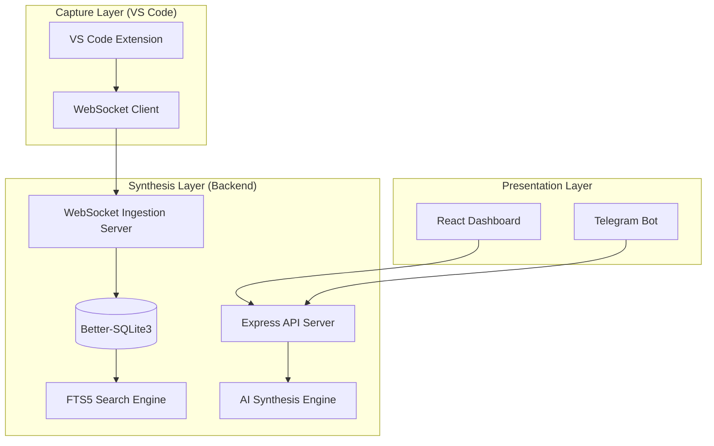

# 🏛️ ContextSwitch: Technical Architecture

This document outlines the system design and data flow of the ContextSwitch platform.

## 🧱 High-Level Overview

ContextSwitch follows a distributed architecture consisting of three main layers: **Capture**, **Synthesize**, and **Present**.



## 🔐 Security & Multi-Tenancy
- **JWT Authentication**: All requests to the Dashboard and Extension are protected by JSON Web Tokens.
- **Scoped Queries**: Every database query is scoped to `user_id`, ensuring no data leaks between different developers.
- **Data Privacy**: No code is sent to external servers except for the minimal context required for AI summarization (handled via secure TLS).

## 💾 Data Persistence
We use **Better-SQLite3** for its exceptional performance in Node.js environments.
- **FTS5 Integration**: We leverage SQLite's Full-Text Search 5 for "Semantic Memory." This allows us to search thousands of coding events and brain dumps instantly without needing a separate vector database.
- **Staleness Algorithm**: A custom algorithm tracks the `last_seen` vs `edit_count` of files to generate a "Staleness Score" (0-100), identifying abandoned files.

## 🤖 AI Pipeline
The system uses a multi-prompt strategy powered by the **Groq LPU** for high-speed inference to generate different types of context:
1. **Context Brief**: 30-second summary for resuming work.
2. **Project Handoff**: Detailed technical overview for teammates.
3. **Daily Digest**: High-level summary for managers or personal reflection.

## 🔌 Ingestion Protocol
The extension streams events in a unified JSON format:
```json
{
  "type": "file:change",
  "project": "my-app",
  "filePath": "/src/auth.ts",
  "diff": "+ import { login } from './api';",
  "ts": 1715184000000
}
```

---

## 🚀 Scalability & Deployment
- **Backend**: Containerized with Docker, ready for deployment on Render or AWS.
- **Frontend**: Static assets served via Vercel/Netlify for global performance.
- **Database**: Easily migratable to PostgreSQL if horizontal scaling is required.
